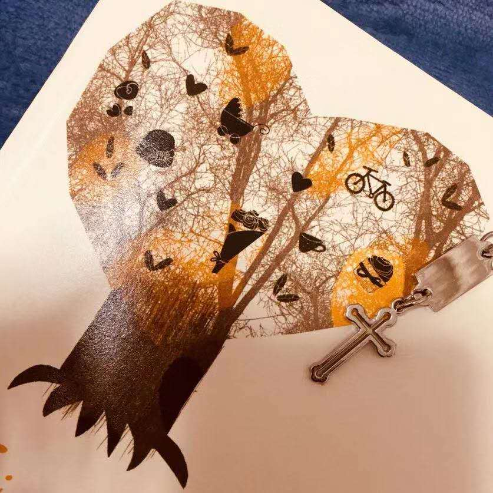
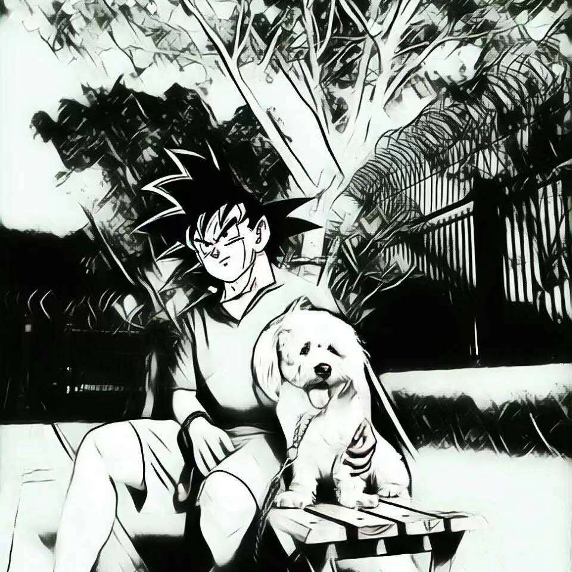

# 沐耳道（MultiTrack）

## 基本简介

沐耳道（MultiTrack ），阿卡贝拉纯人声组合，简称 MLT，寓意为沐浴你耳朵的多声道。沐耳道是由几个有一样的信仰和热爱歌唱的弟兄姊妹组成。他们经常聚在一起唱歌和分享，因为之前有机会接触到阿卡贝拉这样的一种表演形式，在经过一段时间的考虑和磨合后，于 2019 年成立了这样的一个歌唱团体。

**中文名**&nbsp;&nbsp;&nbsp;&nbsp;&nbsp;&nbsp; 沐耳道  
**英文名**&nbsp;&nbsp;&nbsp;&nbsp;&nbsp;&nbsp; MultiTrack  
**出道时间**&nbsp;&nbsp; 2019 年  
**代表作品**&nbsp;&nbsp; 鼓舞  
**成员人数**&nbsp;&nbsp; 11

### 组团背景

### 名称来源

组合名称沐耳道是英文 MultiTrack 音译过来而得名，MultiTrack 意味多音轨混合的，多声道的；沐耳道中文寓意为沐浴你耳朵的多声道。

### 发展历程

| 阶段 | 活动                | 曲目       |
| ---- | ------------------- | ---------- |
| 1    | 2018 圣诞聚餐       | 鼓舞       |
| 2    | 2019 中以友谊音乐会 | Hallelujah |

## 成员资料

按声部的微信顺序

### ^^ ϵ ( o ♪ y

**姓名**&nbsp;&nbsp;&nbsp;&nbsp;&nbsp;&nbsp;&nbsp;&nbsp;&nbsp;&nbsp; ^^ ϵ ( o ♪ y  
**英文名**&nbsp;&nbsp;&nbsp;&nbsp;&nbsp;&nbsp; Melody  
**生日**&nbsp;&nbsp;&nbsp;&nbsp;&nbsp;&nbsp;&nbsp;&nbsp;&nbsp;&nbsp; 2019 年  
**特长**&nbsp;&nbsp;&nbsp;&nbsp;&nbsp;&nbsp;&nbsp;&nbsp;&nbsp;&nbsp;  
**团内担当**&nbsp;&nbsp; 女高音

### M.Y.瞄葉

**姓名**&nbsp;&nbsp;&nbsp;&nbsp;&nbsp;&nbsp;&nbsp;&nbsp;&nbsp;&nbsp; M.Y.瞄葉  
**英文名**&nbsp;&nbsp;&nbsp;&nbsp;&nbsp;&nbsp; 妙  
**生日**&nbsp;&nbsp;&nbsp;&nbsp;&nbsp;&nbsp;&nbsp;&nbsp;&nbsp;&nbsp; 2019 年  
**特长**&nbsp;&nbsp;&nbsp;&nbsp;&nbsp;&nbsp;&nbsp;&nbsp;&nbsp;&nbsp;  
**团内担当**&nbsp;&nbsp; 女高音

### 夏洋兒

**姓名**&nbsp;&nbsp;&nbsp;&nbsp;&nbsp;&nbsp;&nbsp;&nbsp;&nbsp;&nbsp; 夏洋兒  
**英文名**&nbsp;&nbsp;&nbsp;&nbsp;&nbsp;&nbsp;  
**生日**&nbsp;&nbsp;&nbsp;&nbsp;&nbsp;&nbsp;&nbsp;&nbsp;&nbsp;&nbsp; 2019 年  
**特长**&nbsp;&nbsp;&nbsp;&nbsp;&nbsp;&nbsp;&nbsp;&nbsp;&nbsp;&nbsp;  
**团内担当**&nbsp;&nbsp; 女高音

### 雪玲

**姓名**&nbsp;&nbsp;&nbsp;&nbsp;&nbsp;&nbsp;&nbsp;&nbsp;&nbsp;&nbsp; 雪玲  
**英文名**&nbsp;&nbsp;&nbsp;&nbsp;&nbsp;&nbsp; 龙  
**生日**&nbsp;&nbsp;&nbsp;&nbsp;&nbsp;&nbsp;&nbsp;&nbsp;&nbsp;&nbsp; 2019 年  
**特长**&nbsp;&nbsp;&nbsp;&nbsp;&nbsp;&nbsp;&nbsp;&nbsp;&nbsp;&nbsp;  
**团内担当**&nbsp;&nbsp; 女高音

### Jx

**姓名**&nbsp;&nbsp;&nbsp;&nbsp;&nbsp;&nbsp;&nbsp;&nbsp;&nbsp;&nbsp; Jx  
**英文名**&nbsp;&nbsp;&nbsp;&nbsp;&nbsp;&nbsp;  
**生日**&nbsp;&nbsp;&nbsp;&nbsp;&nbsp;&nbsp;&nbsp;&nbsp;&nbsp;&nbsp; 2019 年  
**特长**&nbsp;&nbsp;&nbsp;&nbsp;&nbsp;&nbsp;&nbsp;&nbsp;&nbsp;&nbsp;  
**团内担当**&nbsp;&nbsp; 男高音

### Hugh.X

**姓名**&nbsp;&nbsp;&nbsp;&nbsp;&nbsp;&nbsp;&nbsp;&nbsp;&nbsp;&nbsp; Hugh.X  
**英文名**&nbsp;&nbsp;&nbsp;&nbsp;&nbsp;&nbsp;富贵  
**生日**&nbsp;&nbsp;&nbsp;&nbsp;&nbsp;&nbsp;&nbsp;&nbsp;&nbsp;&nbsp; 2019 年  
**特长**&nbsp;&nbsp;&nbsp;&nbsp;&nbsp;&nbsp;&nbsp;&nbsp;&nbsp;&nbsp;  
**团内担当**&nbsp;&nbsp; 男高音

### 夜风

**姓名**&nbsp;&nbsp;&nbsp;&nbsp;&nbsp;&nbsp;&nbsp;&nbsp;&nbsp;&nbsp; 夜风  
**英文名**&nbsp;&nbsp;&nbsp;&nbsp;&nbsp;&nbsp;  
**生日**&nbsp;&nbsp;&nbsp;&nbsp;&nbsp;&nbsp;&nbsp;&nbsp;&nbsp;&nbsp; 2019 年  
**特长**&nbsp;&nbsp;&nbsp;&nbsp;&nbsp;&nbsp;&nbsp;&nbsp;&nbsp;&nbsp;  
**团内担当**&nbsp;&nbsp; 男高音

### 夜猫

**姓名**&nbsp;&nbsp;&nbsp;&nbsp;&nbsp;&nbsp;&nbsp;&nbsp;&nbsp;&nbsp; 夜猫  
**英文名**&nbsp;&nbsp;&nbsp;&nbsp;&nbsp;&nbsp;老赵  
**生日**&nbsp;&nbsp;&nbsp;&nbsp;&nbsp;&nbsp;&nbsp;&nbsp;&nbsp;&nbsp; 2019 年  
**特长**&nbsp;&nbsp;&nbsp;&nbsp;&nbsp;&nbsp;&nbsp;&nbsp;&nbsp;&nbsp;  
**团内担当**&nbsp;&nbsp; 男中音

### bongxin

**姓名**&nbsp;&nbsp;&nbsp;&nbsp;&nbsp;&nbsp;&nbsp;&nbsp;&nbsp;&nbsp; bongxin  
**英文名**&nbsp;&nbsp;&nbsp;&nbsp;&nbsp;&nbsp;vrmaxin  
**生日**&nbsp;&nbsp;&nbsp;&nbsp;&nbsp;&nbsp;&nbsp;&nbsp;&nbsp;&nbsp; 2019 年  
**特长**&nbsp;&nbsp;&nbsp;&nbsp;&nbsp;&nbsp;&nbsp;&nbsp;&nbsp;&nbsp;  
**团内担当**&nbsp;&nbsp; 男低音

### 空城

**姓名**&nbsp;&nbsp;&nbsp;&nbsp;&nbsp;&nbsp;&nbsp;&nbsp;&nbsp;&nbsp; 空城  
**英文名**&nbsp;&nbsp;&nbsp;&nbsp;&nbsp;&nbsp;小明  
**生日**&nbsp;&nbsp;&nbsp;&nbsp;&nbsp;&nbsp;&nbsp;&nbsp;&nbsp;&nbsp; 2019 年  
**特长**&nbsp;&nbsp;&nbsp;&nbsp;&nbsp;&nbsp;&nbsp;&nbsp;&nbsp;&nbsp;  
**团内担当**&nbsp;&nbsp; 男低音

### 漆得隆冬强

**姓名**&nbsp;&nbsp;&nbsp;&nbsp;&nbsp;&nbsp;&nbsp;&nbsp;&nbsp;&nbsp; 漆得隆冬强  
**英文名**&nbsp;&nbsp;&nbsp;&nbsp;&nbsp;&nbsp;Share  
**生日**&nbsp;&nbsp;&nbsp;&nbsp;&nbsp;&nbsp;&nbsp;&nbsp;&nbsp;&nbsp; 2019 年  
**特长**&nbsp;&nbsp;&nbsp;&nbsp;&nbsp;&nbsp;&nbsp;&nbsp;&nbsp;&nbsp;  
**团内担当**&nbsp;&nbsp; 男高音 Vocal Percussion

## 音乐作品

### 专辑作品

#### 原创

#### 改编

#### 翻唱

### 单曲作品

#### 改编

| 时间       | 歌曲名称 |
| ---------- | -------- |
| 2018-12-23 | 鼓舞     |

#### 翻唱

| 时间       | 歌曲名称   |
| ---------- | ---------- |
| 2019-05-26 | Hallelujah |
